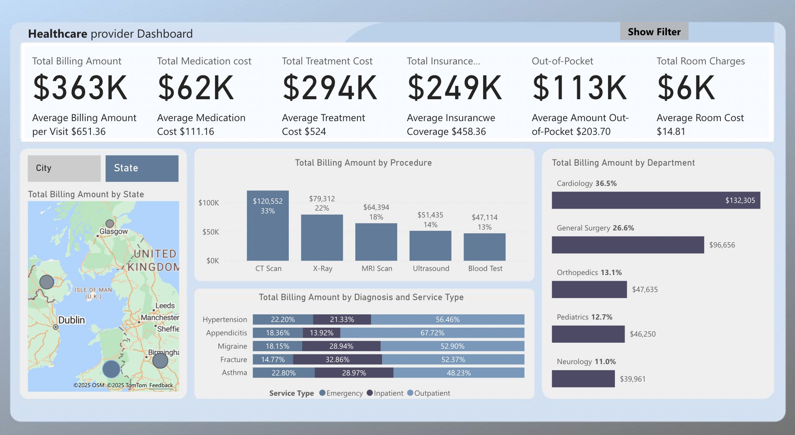
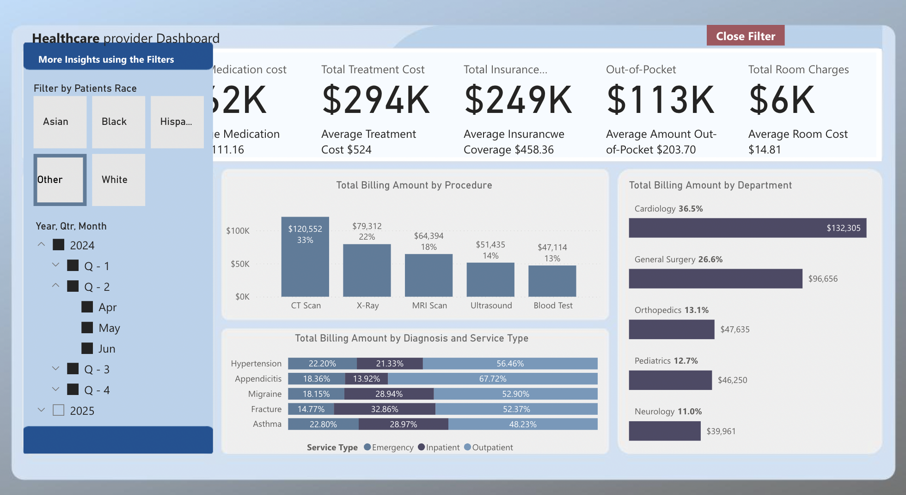

# 🏥 Healthcare Data Model & KPIs in Power BI

### 📊 Overview
This project demonstrates a complete **Power BI data modeling and analytics workflow** for the healthcare domain.  
Using a multi-table dataset covering **patients, departments, procedures, visits, diagnoses, and insurance**, the report models relationships, builds DAX-based KPIs, and presents insights through an interactive dashboard.

The focus is on **data modeling, measure creation, and performance optimization** — the core skills behind enterprise-grade BI solutions.

---

### 🖼️ Dashboard Overview

> 📌 *Figure 1: Main Power BI dashboard page showing healthcare KPIs, department performance, and interactive visuals.*

---

### 📂 Dataset Description
The dataset represents key entities from a hospital information system:

| Table | Description |
|--------|--------------|
| **Cities** | Locations of patients and healthcare facilities |
| **Departments** | Hospital departments such as Cardiology, Oncology, Radiology |
| **Diagnosis** | Diagnostic codes and descriptions |
| **Insurance** | Insurance provider and plan information |
| **Patients** | Demographic and unique identification details |
| **Procedures** | Medical procedures performed during patient visits |
| **Providers** | Doctors, nurses, and specialists |
| **Visits** | Each patient encounter linking departments, providers, and diagnoses |

All tables are modeled into a **star schema**, ensuring efficient filtering and accurate relationships for reporting.

---

### ⚙️ Power BI Development Highlights
- Built a **normalized-to-star schema model** with clearly defined relationships  
- Designed **DAX measures** for key KPIs:
  - Total Visits  
  - Average Visit Duration  
  - Department Efficiency Index  
  - Provider Workload & Productivity  
  - Insurance Utilization Share  
- Developed interactive pages with:
  - **Cards** for headline KPIs  
  - **Bar/Column charts** for departmental trends  
  - **Donut charts** for insurance and diagnosis mix  
  - **Slicer panel** with a toggle button for show/hide interactivity  
- Implemented bookmarks for clean user navigation and filter panels  
- Published to **Power BI Service** for collaboration and refresh scheduling

---

### 🎛️ Slicer Toggle Interaction

The dashboard features a custom **Show/Hide Filter Panel** built using bookmarks and a single toggle button.  
Clicking the button reveals slicers for department, provider, and insurance filters — and clicking again hides them for a cleaner view.

Filters Visible |
|-----------------|
|  |

> 📌 *Figure 2: Demonstration of the slicer toggle button — enabling an interactive filter panel without cluttering the main dashboard.*

---

### 📈 Key Insights
- Department-wise distribution of visits and workload  
- Top diagnoses and procedures by patient volume  
- Provider performance metrics and efficiency trends  
- Insurance coverage breakdown and utilization patterns  

---

### 🧱 Tools & Technologies
- **Power BI Desktop (v2.148.878.0, Oct 2025)** — Data modeling, DAX, visualization  
- **Power Query (M language)** — ETL and transformation  
- **DAX** — Calculated measures and KPIs  
- **GitHub** — Version control and portfolio showcase  

---

